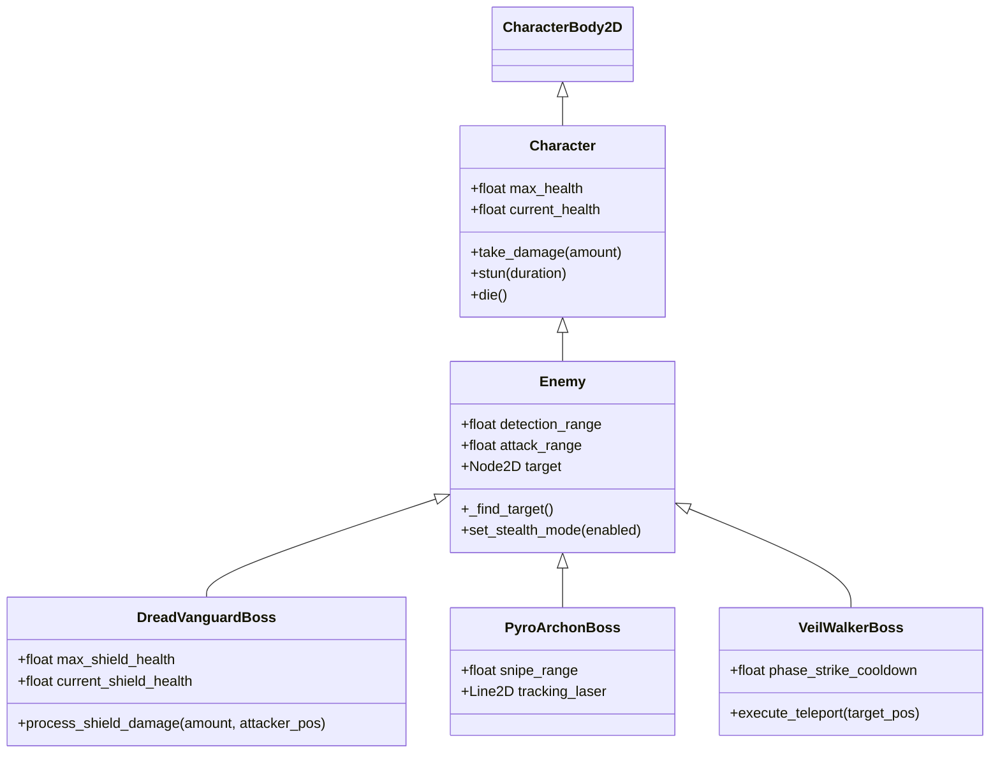
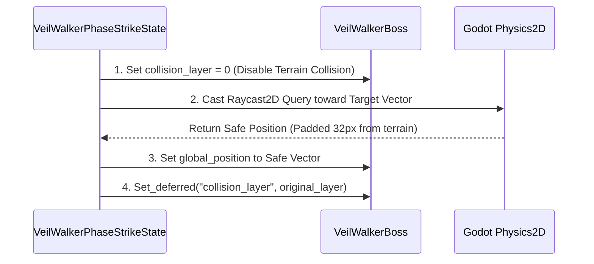
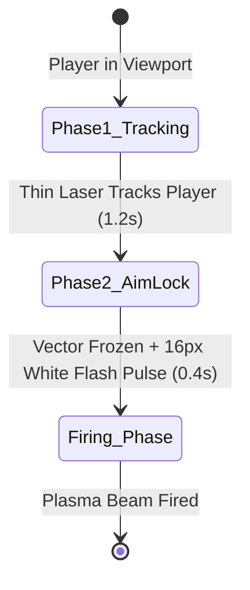
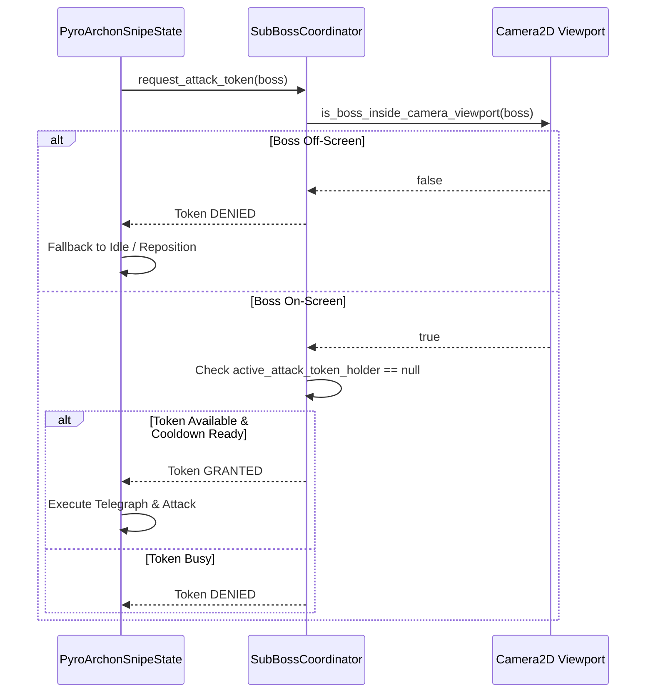

# 🩸 Crimson Claw — Deep Technical Architecture & Systems Engineering Manual

Welcome to the definitive system architecture, engineering specification, and design manual for **Crimson Claw**, a high-octane 2D dark fantasy action-platformer engineered in **Godot 4.6 (Forward+)**.

---

## 📜 1. Narrative & Lore Framework

### The Legend of the Crimson Tyrant
In the ancient, blood-soaked kingdom of *Vaeloria*, a cursed noble bloodline inherited the dark art of blood sorcery. The protagonist—the last surviving heir of this line—possesses the latent power of the **Crimson Tyrant**. By slaying enemies and consuming their bloodthirst, the protagonist activates a terrifying transformation, temporarily transcending mortal speed and strength.

### The Fallen Tri-Archon Covenant
Guarding the inner sanctum are three ancient Sub-Bosses, bound by a dark pact:
* **Dread Vanguard**: An armored wall wielding an impenetrable frontal shield that absorbs 85% of incoming damage until broken.
* **Pyro-Archon**: A ranged marksman who channels high-energy volcanic plasma beams.
* **Veil-Walker**: A shadow assassin who manipulates spatial geometry, stepping through dimension rifts to strike from unexpected angles.

---

## 🏗️ 2. Comprehensive System Architecture & Inter-Element Communication


Crimson Claw is engineered around a **decoupled, signal-driven composition architecture**. Below is the visual schematic blueprint and complete interaction flow detailing every **Godot Signal**, **Custom Method Call**, and **Property Binding** across all core systems.

### 🔄 Complete Signal & Custom Method Interaction Diagram

```mermaid
graph TD
	subgraph Core Physics & Character Base
		C[Character] -->|emits: health_changed| UI_H[HUD / FloatingHealthBar]
		C -->|emits: died| UI_H
		C -->|calls: _physics_process| C
	end

	subgraph Player Subsystem
		P[Player] -->|inherits| C
		P -->|emits: bloodthirst_changed| HUD_B[HUD BloodthirstBar]
		P -->|calls: activate_tyrant_mode| P
		P -->|calls: deactivate_tyrant_mode| P
		P -->|calls: add_bloodthirst| P
		PSM[CharacterStateMachine] -->|calls: change_state| P_State[Melee / Ignis / Hellforge / Tyrant]
		P_State -->|calls: consume_bloodthirst| P
		P_State -->|calls: apply_gravity / move_and_slide| P
	end

	subgraph Combat System (Hitbox & Hurtbox)
		P_HB[Hitbox] -->|signal: area_entered| P_HB
		P_HB -->|custom call: check_overlapping_hits| P_HB
		P_HB -->|custom call: receive_hit| E_HURT[Hurtbox]
		P_HB -->|emits: hit_registered| P
		P -->|slot: _on_attack_hit| P
		E_HURT -->|custom call: process_shield_damage| DV[DreadVanguardBoss]
		E_HURT -->|custom call: take_damage| E[Enemy / Boss]
		E_HURT -->|custom call: apply_burn| BC[BurnComponent]
		E_HURT -->|emits: hit_received| E
	end

	subgraph Enemy & Boss Subsystem
		E -->|inherits| C
		ESM[CharacterStateMachine] -->|calls: change_state| E_State[PhaseStrike / Snipe / Slam]
		DV -->|emits: shield_changed| FHB[FloatingHealthBar]
		DV -->|emits: shield_broken| DV_State[StunState]
		E_State -->|calls: move_and_slide| E
	end

	subgraph Tri-Boss Coordinator
		SBC[SubBossCoordinator] -->|custom call: is_boss_inside_camera_viewport| CAM[Camera2D]
		E_State -->|custom call: request_attack_token| SBC
		SBC -->|returns: true / false| E_State
	end

	subgraph Global Autoloads
		P_State -->|custom call: play_sfx| SFX[SfxManager]
		E_State -->|custom call: play_sfx| SFX
	end
```

---

### ⚡ Detail Breakdown of System Interactions

#### A. Player ➔ Hitbox ➔ Hurtbox ➔ Enemy Combat Loop
1. **Attack State Activation**: `MeleeAttackState.enter()` executes `hitbox_shape.set_deferred("disabled", false)` and calls `hitbox.call_deferred("check_overlapping_hits")`.
2. **Overlap & Signal Trigger**: `Hitbox._on_area_entered(area)` detects an overlapping `Hurtbox`.
3. **Hit Delivery**: `Hitbox` calculates knockback direction and invokes `hurtbox.receive_hit(damage, knockback, stun_duration, attacker, inflicts_fire, fire_dps, fire_duration)`.
4. **Attacker Feedback**: `Hitbox` emits `hit_registered(hurtbox)` signal back to `Player._on_attack_hit(hurtbox, hitbox)`, triggering `player.add_bloodthirst(hitbox.bloodthirst_gain)`.
5. **Damage Processing & Mitigation**:
   - If the victim is **Dread Vanguard**, `Hurtbox` calls `entity.process_shield_damage(final_damage, attacker_pos)`. Frontal hits reduce damage by **85%** and deduct from `current_shield_health`. Emits `shield_changed`.
   - Remaining damage passes to `entity.take_damage(final_damage)`, deducting from `current_health` and emitting `health_changed`.
6. **UI Refresh**: `FloatingHealthBar._on_health_changed()` catches the signal and triggers an animated fill redraw (`queue_redraw()`) and contextual fade-in.

---

## 🧮 3. Technical Design Choices & Rationale

### 1. State Machine Composition (`CharacterStateMachine` & `CharacterState`)
* **Decision**: Refactored monolithic player and enemy logic into isolated node-based state classes.
* **Rationale**: Eliminates bloated `switch/case` and state variable soup (`is_jumping`, `is_attacking`, `is_dashing`). Each state (`MeleeAttackState`, `DashState`, `IgnisClawState`, `PyroArchonSnipeState`) manages its own enter/exit lifecycles, timer cleanup, animation playback, and physics logic.

### 2. Bloodthirst Resource as a Dynamic Duration Timer
* **Decision**: When entering **Crimson Tyrant Mode**, the Bloodthirst bar does NOT drop to zero instantly. Instead, it smoothly drains from **100% ➔ 0% over 10 seconds**.
* **Rationale**: Gives the player a clear, real-time HUD timer for the transformation while granting **free, zero-cost special skill casts** (Ignis Claw & Hellforge Dive) throughout the transformation duration.

### 3. Decoupled Hitbox/Hurtbox Matrix
* **Decision**: Separated physical character collision (`CharacterBody2D`) from damage detection (`Area2D` Hitboxes and Hurtboxes).
* **Rationale**: Allows precise tuning of attack reach and vulnerability hitboxes independent of physical terrain navigation.

---

## ☠️ 4. Enemy Architecture & Engineering Deep Dives



---

### 🌌 4.1 Veil-Walker & The Spatial Physics Lock Problem

#### 🐛 The Problem (Physics Body Lockups):
During the **Phase Strike** attack, the Veil-Walker teleports directly behind or above the player. Early implementations updated `global_position = target_position` during mid-physics frame execution. This caused severe **physics body lockups** where the boss's `CollisionShape2D` overlapped with level tilemaps or solid terrain geometry, trapping the boss inside walls and permanently freezing the physics solver.

#### 🛠️ The Technical Solution:
To resolve physics locks permanently, we implemented a 4-step safe phase translation pattern in `veil_walker_phase_strike_state.gd`:



1. **Terrain Collision Deactivation**: Immediately set `collision_layer = 0` prior to position translation so the physics solver does not register a solid collision overlap.
2. **Raycast Safety Verification**: Perform a `PhysicsRayQueryParameters2D` check from the player toward the target teleport destination. If the ray hits a wall, offset the target position `32px` inward away from terrain.
3. **Deferred Collision Re-enablement**: Call `set_deferred("collision_layer", original_layer)` after updating `global_position`, ensuring the transform is updated before collision response resumes.

---

### 🎯 4.2 Pyro-Archon Telegraphic Laser & Viewport Verification

#### Telegraphic Design Philosophy:
To ensure long-range sniper attacks feel challenging rather than unfair, the Pyro-Archon uses a **2-Phase Visual Telegraph**:



* **Phase 1 (Tracking Laser)**: Renders a thin, semi-transparent red `Line2D` from the rifle barrel to the player's position, dynamically tracking movement.
* **Phase 2 (Aim-Lock & Flash Pulse)**: Locks the aiming vector to a fixed trajectory, expands laser width, and fires a **16px white-flash reticle snap pulse**—signaling the exact moment for the player to press `Dash`.

---

### 🛡️ 4.3 Dread Vanguard Frontal Shield & Radial Blast

#### Frontal Mitigation Logic (`process_shield_damage`):
When hit, the Dread Vanguard calculates the relative attack angle:
$$\text{attack\_dir} = \text{sign}(\text{attacker.x} - \text{boss.x})$$
$$\text{is\_frontal} = (\text{attack\_dir} == \text{facing\_direction}) \lor (\text{attack\_dir} == 0)$$

If `is_frontal == true`:
* **85% of incoming damage** is routed to `current_shield_health` (80.0 HP).
* Only **15%** penetrates to main HP.
* When shield HP drops to 0, the boss emits `shield_broken`, triggering a **3.0-second Stun Window**.

---

## ⚔️ 5. Sub-Boss Coordinator (`SubBossCoordinator`) Architecture

To orchestrate the Tri-Boss fight without overwhelming the player, the `SubBossCoordinator` enforces an **Attack Token System** combined with **Camera Viewport Filtering**.

### ⚙️ Attack Token Distribution Algorithm & Sequence



---

## ⚔️ 6. Combat Matrix & Resolution Solutions

### 1. Basic Melee Hit Registration & i-Frame Tuning
* **Problem**: Players reported that consecutive sword hits in a fast combo were doing zero damage.
* **Cause**: Default `Hurtbox` invincibility duration was set to `0.5s`. Because basic attack swings take ~`0.35s`, the second hit connected while the enemy was still invincible!
* **Fix**: Reduced default `Hurtbox.invincibility_duration` to **`0.08s`** for enemies, while explicitly setting player hurtbox `invincibility_duration = 0.4s` in `player.tscn`.

### 2. Static Point-Blank Overlap Resolution
* **Problem**: Standing point-blank against an enemy when initiating a swing sometimes failed to trigger `area_entered`.
* **Fix**: Added `check_overlapping_hits()` to `Hitbox` and invoked it via `call_deferred` inside `MeleeAttackState.enter()`, ensuring static overlapping hurtboxes take damage on frame 1.

---

## 📺 7. Display & Viewport Scaling Configuration

To achieve crisp high-DPI scaling across all monitor resolutions without letterboxing:

```ini
[display]
window/size/viewport_width=640
window/size/viewport_height=360
window/size/window_width_override=1280
window/size/window_height_override=720
window/size/resizable=true
window/stretch/mode="canvas_items"
window/stretch/aspect="expand"
window/stretch/scale=1.0
```

---

## 📂 8. Complete Project File Directory Map

```
CrimsonClaw/
├── Scenes/
│   ├── Core/Autoloads/
│   │   └── sfx_manager.tscn
│   ├── Entities/
│   │   ├── Player/player.tscn
│   │   └── Enemy/ (enemy & boss scenes)
│   └── Levels/
│       └── combat_demo_level.tscn
├── Scripts/
│   ├── Core/
│   │   ├── character.gd
│   │   ├── character_state_machine.gd
│   │   ├── hitbox.gd
│   │   ├── hurtbox.gd
│   │   ├── burn_component.gd
│   │   └── floating_health_bar.gd
│   └── Entities/
│       ├── Player/
│       │   ├── player.gd
│       │   └── States/ (idle, walk, jump, dash, melee, ignis, hellforge, tyrant)
│       └── Enemy/
│           ├── enemy.gd
│           ├── sub_boss_coordinator.gd
│           ├── dread_vanguard_boss.gd
│           ├── pyro_archon_boss.gd
│           ├── veil_walker_boss.gd
│           ├── radial_shield_blast.gd
│           └── States/ (boss attack states)
├── README.md
└── project.godot
```

---
*Manual compiled and verified for Crimson Claw v1.0. All architecture modules and interaction diagrams fully documented.*
